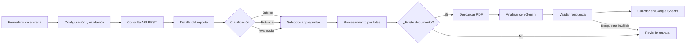

# Automatización de análisis documental con n8n

Pipeline de automatización que recibe un identificador empresarial, consulta
información mediante APIs REST, clasifica los requisitos aplicables, procesa
documentos PDF con Google Gemini y registra resultados estructurados en
Google Sheets.

> Este repositorio es una demostración sanitizada. Utiliza datos sintéticos y
> no contiene credenciales, documentos reales ni información de clientes.

## Problema

La revisión manual de documentos puede requerir consultar diferentes sistemas,
descargar archivos, verificar criterios y consolidar los resultados. Este
workflow organiza esas tareas en un flujo reproducible y trazable.

## Solución

El workflow:

1. Recibe un identificador empresarial.
2. Consulta la información asociada.
3. Clasifica el caso como básico, estándar o avanzado.
4. Selecciona las preguntas aplicables.
5. Procesa cada pregunta por lotes.
6. Valida si existe un documento asociado.
7. Descarga y convierte el archivo a PDF.
8. Analiza el documento mediante Google Gemini.
9. Normaliza y valida la respuesta.
10. Registra el resultado en Google Sheets.
11. Envía los casos ambiguos a revisión manual.

## Arquitectura

## Tecnologías

- n8n
- Docker y Docker Compose
- APIs REST
- JavaScript
- Google Gemini
- Google Sheets
- JSON
- GitHub Actions

## Estructura del repositorio

- `workflows/`: workflow sanitizado para importar en n8n.
- `samples/`: datos completamente sintéticos.
- `docs/`: arquitectura, instalación y decisiones técnicas.
- `scripts/`: validaciones automatizadas.
- `.github/workflows/`: integración continua de GitHub.

## Requisitos

- Docker y Docker Compose.
- Credencial de Google Gemini.
- Credencial OAuth de Google Sheets.
- Una hoja de cálculo de prueba.
- Acceso autorizado a las APIs que se deseen integrar.

## Instalación local

1. Clonar el repositorio.
2. Copiar `.env.example` como `.env`.
3. Establecer una clave de cifrado y la versión de n8n.
4. Ejecutar `docker compose up -d`.
5. Abrir n8n en `http://localhost:5678`.
6. Importar `workflows/document-compliance-demo.json`.
7. Configurar las credenciales desde la interfaz de n8n.
8. Seleccionar una hoja de cálculo de prueba.

## Credenciales

Las credenciales no están incluidas en el repositorio.

Después de importar el workflow se deben configurar:

- Autenticación de la API REST.
- Google Gemini.
- Google Sheets OAuth2.

Nunca se deben escribir tokens directamente dentro de nodos `Set`, `Code` o
`HTTP Request`.

## Datos de demostración

Los archivos de `samples/` son sintéticos y no representan empresas,
personas o documentos reales.

## Manejo de errores

El workflow contempla:

- Reintentos de descarga.
- Reintentos del modelo de IA.
- Documentos ausentes o inválidos.
- Respuestas no estructuradas.
- Casos que requieren revisión manual.

## Limitaciones

- La calidad del resultado depende de la legibilidad del documento.
- Las respuestas generadas por IA deben ser validadas.
- El workflow no sustituye una decisión jurídica, administrativa o de
  cumplimiento tomada por una persona autorizada.
- Las APIs de producción no están incluidas en esta demostración.

## Seguridad

Consulta [SECURITY.md](SECURITY.md) y
[docs/security.md](docs/security.md).

## Autor

Jesús González  
Ingeniería Mecatrónica | Automatización e integración de aplicaciones

## Licencia

MIT. Consulta [LICENSE](LICENSE).